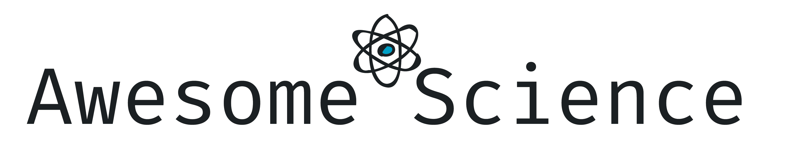

# Awesome Science

A currated list of awesome scientific software, libraries and services.

Inspired by [awesome-lists](https://github.com/topics/awesome-lists).

[Contribute :fontawesome-brands-github:](https://github.com/deverte/awesome-science){: .md-button }
[Join :fontawesome-brands-discord:](https://discord.gg/Fc9u6yEzRH){: .md-button }

## MOOCs

*Massive open online courses.*

- [Coursera](https://www.coursera.org/) - MOOC founded by Stanford University's professors.
- [edX](https://www.edx.org/) - MOOC created by MIT and Harvard University.
- [Stepik](https://stepik.org/) - Russian MOOC.
- [teach-in](https://teach-in.ru/) - Open video lectures training courses of Moscow State University.
- [Лекторий МФТИ](https://mipt.lectoriy.ru/) - Moscow Institute of Physics and Technology video lectures.
- [Лекториум](https://www.lektorium.tv/) - MOOC founded at Saint Petersburg.
- [Открытое образование](https://openedu.ru/) - Courses of leading Russian universities.

## Services

*Services helpful for scientific work.*

- [PhysicsOverflow](https://physicsoverflow.org/) - Q&A system for physics.
- [Scimago Journal & Country Rank](https://www.scimagojr.com/) - Journal and country rankings.

## Archives

*Archives with scholarly articles.*

- E-Print
    - [arXiv.org](https://arxiv.org/) - E-Print archive for physics, mathematics, computer science, economics and engineering.
    - [bioRxiv](https://www.biorxiv.org/) - Preprint server for biology.
    - [ChemRxiv](https://chemrxiv.org/) - Preprint server for chemistry.
    - [medRxiv](https://www.medrxiv.org/) - Preprint server for health sciences.
    - [PsyArXiv](https://psyarxiv.com/) - Preprint service for the psychological sciences.
    - [SocArXiv](https://osf.io/preprints/socarxiv) - Preprint service for the social sciences.
    - [viXra.org](https://vixra.org/) - Unorthodox and fringe science e-print archive ([warning](https://webspace.science.uu.nl/~hooft101/fringe-oct-2017.pdf)).
- Libraries
    - [HAL](https://hal.archives-ouvertes.fr/) - Open archive for scholarly documents.
    - [IEEE Xplore](https://ieeexplore.ieee.org/Xplore/home.jsp) - IEEE archive.
    - [Library Genesis](https://libgen.fun/) - Shadow library for scientific and general-interest books ([warning](https://en.wikipedia.org/wiki/Shadow_library)).
        - [@libgen_book_bot - Telegram](https://t.me/libgen_book_bot) - Unofficial Libgen bot for Telegram Messenger.
    - [PeerJ](https://peerj.com/) - Open access peer-reviewed scientific mega journal covering research in the biological and medical sciences.
    - [Z-Library](https://z-lib.org/) - Shadow library project for file-sharing access to pirated scholarly journal articles, academic texts, and general-interest books without the permission of authors or payment to them ([warning](https://en.wikipedia.org/wiki/Shadow_library)).
    - [КиберЛенинка](https://cyberleninka.ru/) - Open science Russian library.
- Search engines
    - [CiteSeerX](http://citeseerx.ist.psu.edu/) - Search engine for scientific and academic papers.
    - [Google Scholar](https://scholar.google.com/) - Web search engine for scholarly literature.
    - [PeerLibrary](https://peerlibrary.org/) - Search engine for academic publications and people.
    - [PubMed](https://pubmed.ncbi.nlm.nih.gov/) - Citations for biomedical literature.
    - [Sci-Hub](https://vk.com/sci_hub) - Shadow library website with access to research papers ([warning](https://en.wikipedia.org/wiki/Shadow_library)).
        - [@scihubot - Telegram](https://t.me/scihubot) - Official Sci-Hub bot for Telegram Messenger.
    - [Semantic Scholar](https://www.semanticscholar.org/) - Scientific literature search engine.

## Literature Management

*Reference managers and literature organizers.*

- [BibTeX](http://tug.org/bibtex/) - Reference management software for formatting lists of references (**Open Source**).
- [EndNote](https://endnote.com/) - Bibliography information and reference manager (**EULA / Commercial**).
- [JabRef](https://www.jabref.org/) - Reference manager (**Open Source**).
- [Mendeley](https://www.mendeley.com/) - Reference and literature collection manager with PDFs annotation (**EULA / Free**).
- [Qiqqa](https://github.com/jimmejardine/qiqqa-open-source) - Reference manager and PDFs annotation (**Open Source**).
- [Zotero](https://www.zotero.org/) - Program for collecting, orginizing, synchronizing and citing scientific literature (**Open Source**).

## Social

*Scientific communication.*

- [Academia.edu](https://www.academia.edu/) - Paper sharing service.
- [ResearchGate](https://www.researchgate.net/) - Scientific social network.

## Project Management

*Scientific projects management.*

- Communication
    - [Discord](https://discord.com/) - Instant messaging and VoIP (**EULA / Free**).
    - [Element.io](https://element.io/) - Cross-platform messenger based on Matrix protocol (**Open Source**).
    - [Freenode](http://freenode.net/) - IRC-network (**Open Source**).
    - [Slack](https://slack.com/intl/en-ru/) - Business communication platform (**EULA / Freemium**).
    - [Telegram Messenger](https://telegram.org/) - Instant messaging application with a bots platform (**Open Source** (client), **Proprietary** (server)).
        - [@libgen_book_bot - Telegram](https://t.me/libgen_book_bot) - Unofficial Libgen bot for Telegram Messenger.
        - [@scihubot - Telegram](https://t.me/scihubot) - Official Sci-Hub bot for Telegram Messenger.
- Project Management
    - [Azure DevOps](https://azure.microsoft.com/services/devops/) - Version control, reporting, requirements management, project management and more (**EULA / Freemium**).
    - [GitHub](https://github.com/) - Hosting for IT projects and version control. Can be used for general purpose projects (including scientific) (**EULA / Freemium**).
        - [Github Issues and Github Projects](https://github.com/features/project-management/) - Coordination, tracking, and updating work in GitHub (**EULA / Freemium**).
        - [GitKraken Boards](https://www.gitkraken.com/boards) - Free Kanban boards with GitHub Issue sync, pull request automation & more (**EULA / Freemium**).
    - [Jira](https://www.atlassian.com/software/jira) - Bug tracking and agile project management (**EULA / Freemium**).
    - [Kanboard](https://kanboard.org/) - Kanban project management software (**Open Source**).
    - [Notion](https://www.notion.so/) - Note taking, wiki and project management application (**EULA / Freemium**).
    - [Org mode](https://orgmode.org/) - GNU Emacs major mode for keeping notes, authoring documents, computational notebooks, literate programming, maintaining to-do lists, planning projects, and more — in a fast and effective plain text system (**Open Source**).
    - [Redmine](https://www.redmine.org/) - Flexible project management web application (**Open Source**).
    - [Restyaboard](https://restya.com/board/) - Kanban board for task management (**Open Source**).
    - [Taiga Agile](https://www.taiga.io/) - Project management tool for multi-functional agile teams (**Open Source**).
    - [Trello](https://trello.com/) - Project management with kanban boards (**EULA / Freemium**).
    - [Yandex.Tracker](https://yandex.com/tracker/index?turbo=true) - Project management and organizational tool (**EULA / Freemium**).
- Project Wiki
    - [Confluence](https://www.atlassian.com/software/confluence) - Web-based corporate wiki (**EULA / Freemium**).
    - [docsify](https://docsify.js.org/) - A magical documentation site generator (**Open Source**).
    - [Docusaurus](https://v2.docusaurus.io/) - A project for building, deploying, and maintaining open source project websites easily (**Open Source**).
    - [Gatsby](https://www.gatsbyjs.com/) - A framework based on ReactJS, Webpack, JavaScript and CSS that helps developers quickly build very fast static websites and apps (**Open Source**).
    - [GitBook](https://www.gitbook.com/) - A modern documentation platform where teams can document everything from products to internal knowledge-bases and APIs (**EULA / Freemium**).
    - [GitHub](https://github.com/) - Hosting for IT projects and version control. Can be used for general purpose projects (including scientific) (**EULA / Freemium**).
        - [GitHub Pages](https://pages.github.com/) - Websites for projects, hosted directly from GitHub repository (**EULA / Freemium**).
        - [GitHub Wikis](https://guides.github.com/features/wikis/) - GitHub repository's wiki to share long-form content about project (**EULA / Freemium**).
    - [Jekyll](https://jekyllrb.com/) - Simple, blog-aware, static sites (**Open Source**).
    - [MkDocs](https://www.mkdocs.org/) - A fast, simple and downright gorgeous static site generator that's geared towards building project documentation (**Open Source**).
    - [Notion](https://www.notion.so/) - Note taking, wiki and project management application (**EULA / Freemium**).
    - [Obsidian](https://obsidian.md/) - Powerful knowledge base that works on top of a local folder of plain text Markdown files (**EULA / Freemium**).
    - [Read the Docs](https://readthedocs.org/) - Read the Docs hosts documentation for the open source community (**Open Source**).
    - [VuePress](https://vuepress.vuejs.org/) - Vue-powered Static Site Generator (**Open Source**).

## Engineering

*Experimental device creation and automation tools.*

- Material and element base
    - [AliExpress](https://www.aliexpress.com/) - Online retail service (including rich element and materials base).
    - [eBay](https://www.ebay.com/) - Auction-style sales web site (including electrical equipment and etc.).
- Software
    - [Altium Designer](https://www.altium.com/altium-designer/) - PCB and electronic design automation software package for printed circuit boards (**EULA / Commercial**).
    - [AutoCAD](https://www.autodesk.com/products/autocad/overview) - Computer-aided design (CAD) and drafting software application (**EULA / Commercial**).
    - [diagrams.net](https://www.diagrams.net/) - Diagram Software and Flowchart Maker (**Open Source**).
    - [flowchart.js](https://flowchart.js.org/) - Draws simple SVG flow chart diagrams from textual representation of the diagram (**Open Source**).
    - [FreeCAD](https://www.freecadweb.org/) - general-purpose parametric 3D computer-aided design (CAD) modeler and a building information modeling (BIM) software with finite element method (FEM) support (**Open Source**).
    - [Intel Quartus Prime](https://www.intel.com/content/www/us/en/software/programmable/quartus-prime/overview.html) - Programmable logic device design software (**EULA / Freemium**).
    - [KiCad](https://www.kicad.org/) - Suite for electronic design automation (EDA) (**Open Source**).
    - [LibreOffice Draw](https://www.libreoffice.org/) - Vector graphical editor based on *Apache OpenOffice Draw* (**Open Source**).
    - [mermaid](https://mermaid-js.github.io/mermaid/) - Markdownish syntax for generating flowcharts, sequence diagrams, class diagrams, gantt charts and git graphs (**Open Source**).
    - [Microsoft Visio](https://www.microsoft.com/microsoft-365/visio/flowchart-software) - Diagramming and vector graphics application (**EULA / Commercial**).
    - [OpenOffice Draw](http://www.openoffice.org/) - Vector graphical editor (**Open Source**).
    - [SOLIDWORKS](https://www.solidworks.com/) - Solid modeling computer-aided design (CAD) and computer-aided engineering (CAE) computer program (**EULA / Commercial**).

## Instruments

*Modeling, calculations and etc.*

- Universal
    - [Blender](https://www.blender.org/) - 3D computer graphics software toolset with ability to simulate physical, chemical, biological, ... systems with game engines (**Open Source**).
        - [Armory](https://armory3d.org/) - 3D game engine with full *Blender* integration (**Open Source**).
    - [Godot Engine](https://godotengine.org/) - 2D and 3D game engine (**Open Source**).
- Chemistry
    - [Quantum ESPRESSO](https://www.quantum-espresso.org/) - Suite for first-principles electronic-structure calculations and materials modeling (**Open Source**).
- Physics / Engineering
    - [Cirq](https://quantumai.google/cirq) - An open source framework for programming quantum computers (**Open Source**).
    - [IBM Quantum Experience](https://quantum-computing.ibm.com/) - Online platform for quantum processors prototyping (**EULA / Free**).
    - [PennyLane](https://pennylane.ai/) - Python library for differentiable programming of quantum computers (**Open Source**).
    - [Qiskit](https://qiskit.org/) - An open source SDK for working with quantum computers at the level of pulses, circuits and application modules (**Open Source**).
    - [Quantum ESPRESSO](https://www.quantum-espresso.org/) - Suite for first-principles electronic-structure calculations and materials modeling (**Open Source**).
    - [QuTiP](http://qutip.org/) - Software for simulating the dynamics of open quantum systems (**Open Source**).
    - [Simulink](https://www.mathworks.com/products/simulink.html) - Simulation and Model-Based Design (**EULA / Commercial**).
    - [Strawberry Fields](https://strawberryfields.ai/) - Python library for simulating and executing programs on quantum photonic hardware (**Open Source**).
    - [Xcos](https://www.scilab.org/software/xcos) - Dynamic systems modeler and simulator in discrete and continuous time domains (**Open Source**).

## Data Storage

*Storages for scientific data.*

- Repositories
    - [DVC (Data Version Control)](https://dvc.org/) - Open-source Version Control System for Machine Learning Projects.
    - [figshare](https://figshare.com/) - Storage for research content.
- Databases
    - [MariaDB](https://mariadb.org/) - Relational database.
    - [MySQL](https://www.mysql.com/) - Relational database.
    - [PostgreSQL](https://www.postgresql.org/) - Relational database.

## Data Processing

*Data processing software, libraries and platforms.*

- Languages
    - [C++](https://isocpp.org/) - General purpose language with high performance.
    - [Julia](https://julialang.org/) - Language for mathematical computations with high performance.
    - [Python](https://www.python.org/) - General purpose language with many scientific libraries.
        - [Numba](https://numba.pydata.org/) - JIT compiler that translates a subset of Python and NumPy code into fast machine code (**Open Source**).
    - [R](https://www.r-project.org/) - Statistical computing and graphics.
- Libraries
    - Multi-language
        - [Apache Arrow](https://arrow.apache.org/) - Cross-language development platform for in-memory analytics (**Open Source**).
    - C/C++
        - [Boost C++ Libraries](https://www.boost.org/) - Free peer-reviewed portable C++ source libraries (**Open Source**).
        - [OpenCL](https://www.khronos.org/api/opencl) - Open, royalty-free standard for cross-platform, parallel programming of diverse accelerators found in supercomputers, cloud servers, personal computers, mobile devices and embedded platforms (**EULA**).
        - [PyTorch](https://pytorch.org/) - Machine learning framework (**Open Source**).
        - [ROOT](https://root.cern.ch/) - Data analysis framework for C++ (**Open Source**).
        - [TensorFlow](https://www.tensorflow.org/) - Platform for machine learning (**Open Source**).
        - [Xframe](https://xframe.readthedocs.io/en/latest/) - C++ library meant for numerical analysis with multi-dimensional labeled array expressions (also referred as variable expressions) and data frame expressions (**Open Source**).
        - [Xtensor](https://xtensor.readthedocs.io/en/latest/) - C++ library meant for numerical analysis with multi-dimensional array expressions (**Open Source**).
    - Go
        - [Gonum](https://www.gonum.org/) - A set of packages designed to make writing numerical and scientific algorithms productive, performant, and scalable (**Open Source**).
        - [TensorFlow](https://www.tensorflow.org/) - Platform for machine learning (**Open Source**).
    - Java
        - [PyTorch](https://pytorch.org/) - Machine learning framework (**Open Source**).
        - [TensorFlow](https://www.tensorflow.org/) - Platform for machine learning (**Open Source**).
    - Python
        - [Astropy](https://www.astropy.org/) - Community effort to develop a common core package for Astronomy in Python (**Open Source**).
        - [Diofant](https://diofant.readthedocs.io/en/latest/) - Python library for symbolic mathematics (fork of the _SymPy_).
        - [Gensim](https://radimrehurek.com/gensim/) - An open-source library for unsupervised topic modeling and natural language processing, using modern statistical machine learning (**Open Source**).
        - [NetworkX](https://networkx.org/) - A Python package for the creation, manipulation, and study of the structure, dynamics, and functions of complex networks (**Open Source**).
        - [Natural Language Toolkit (NLTK)](https://www.nltk.org/) - A suite of libraries and programs for symbolic and statistical natural language processing (NLP) for English written in the Python programming language (**Open Source**).
        - [Open Neural Network Exchange (ONNX)](https://onnx.ai/index.html) - An open format built to represent machine learning models (**Open Source**).
        - [PyTorch](https://pytorch.org/) - Machine learning framework (**Open Source**).
        - [scikit-learn](https://www.sklearn.org/) - Machine learning library (**Open Source**).
        - [SciPy](https://www.scipy.org/) - Ecosystem for mathematics, science and engineering based on Python (**Open Source**).
            - [NumPy](https://numpy.org/) - Base N-dimensional array package (**Open Source**).
            - [pandas](https://pandas.pydata.org/) - Data structures & analysis (**Open Source**).
            - [SciPy library](https://www.scipy.org/scipylib/index.html) - Fundamental library for scientific computing (**Open Source**).
            - [SymPy](https://www.sympy.org/en/index.html) - Symbolic mathematics (**Open Source**).
        - [statsmodels](https://www.statsmodels.org/) - Python module for statistical models (**Open Source**).
        - [TensorFlow](https://www.tensorflow.org/) - Platform for machine learning (**Open Source**).
- Platforms
    - [Anaconda](https://anaconda.org/) - Python and R distribution with many scientific libraries (**Open Source / Freemium**).
        - [Conda](https://docs.conda.io/en/latest/) - Package, dependency and environment management for any language—Python, R, Ruby, Lua, Scala, Java, JavaScript, C/ C++, FORTRAN, and more (**Open Source**).
        - [Mamba](https://mamba.readthedocs.io/en/latest/index.html) - Fast, robust, and cross-platform package manager (**Open Source**).
    - [JupyterLab / Jupyter Notebook](https://jupyter.org/) - Interactive documents with live code, equations and visualization for [many languages](https://github.com/jupyter/jupyter/wiki/Jupyter-kernels) (**Open Source**).
        - [Xeus Cling](https://xeus-cling.readthedocs.io/en/latest/index.html) - Jupyter kernel for C++ based on the C++ interpreter cling and the native implementation of the Jupyter protocol xeus (**Open Source**).
- IDE / CAS
    - [Axiom](http://www.axiom-developer.org/) - General-purpose computer algebra system (**Open Source**).
    - [Deepnote](https://deepnote.com/) - Data science notebook for teams (**EULA / Freemium**).
    - [GNU Octave](https://www.gnu.org/software/octave/index) - Mathematics-oriented language and IDE with visualization tools (**Open Source**).
    - [Google Colaboratory](https://colab.research.google.com/) - Python code in browser with access to GPU and TPU (**EULA / Free**).
    - [Google Docs](https://docs.google.com/document/?usp=mkt_docs) - Online office with spreadsheet (**EULA / Free**).
    - [Juno](https://junolab.org/) - Julia IDE based on Atom text editor (**Open Source**).
    - [LabVIEW](https://www.ni.com/ru-ru/shop/labview.html) - Visual programming IDE for engineers (**EULA / Commercial**).
    - [LibreOffice Calc](https://www.libreoffice.org/) - WYSWYG table processor based on *Apache OpenOffice Calc* (**Open Source**).
    - [Magma](http://magma.maths.usyd.edu.au/magma/) - a computer algebra system designed to solve problems in algebra, number theory, geometry and combinatorics (**EULA / Free**).
    - [Maple](https://www.maplesoft.com/) - A symbolic and numeric computing environment as well as a multi-paradigm programming language (**EULA / Commercial**).
    - [Mathcad](https://www.mathcad.com/en/) - Math software for engineering (**EULA / Commercial**).
    - [MATLAB](https://www.mathworks.com/products/matlab.html) - Mathematics and graphics for engineers and scientists (**EULA / Commercial**).
    - [Maxima](https://maxima.sourceforge.io/) - A system for the manipulation of symbolic and numerical expressions, including differentiation, integration, Taylor series and etc (**Open Source**).
    - [Microsoft Excel](https://www.microsoft.com/microsoft-365/excel) - Spreadsheet with calculations, graphing and macro programming (**EULA / Commercial**).
    - [Microsoft Power BI](https://powerbi.microsoft.com/) - Data visualization (**EULA / Commercial**).
    - [ONLYOFFICE](https://www.onlyoffice.com/) - Office almost fully compatible with *Microsoft Office* (**Open Source**).
    - [OpenOffice Calc](http://www.openoffice.org/) - WYSWYG table processor (**Open Source**).
    - [Orange](https://orange.biolab.si/) - Data mining tools (**Open Source**).
    - [OriginLab](https://www.originlab.com/) - Graphing and data analysis (**EULA / Commercial**).
    - [PAST (Paleontological Statistics)](https://www.nhm.uio.no/english/research/infrastructure/past/) - Software for scientific data analysis, with functions for data manipulation, plotting, univariate and multivariate statistics, ecological analysis, time series and spatial analysis, morphometrics and stratigraphy (**EULA / Free**).
    - [PyCharm](https://www.jetbrains.com/pycharm/) - The Python IDE for Professional Developers (includes scientific tools) (**Open Source** or **EULA / Commercial**).
    - [RStudio](https://rstudio.com/) - IDE for R language (**Open Source**).
    - [SageMath](https://www.sagemath.org/) - Mathematics software system (**Open Source**).
    - [SciDAVis](http://scidavis.sourceforge.net/) - Scientific data analysis and visualization (**Open Source**).
    - [SciLab](https://www.scilab.org/) - Software for numerical computation (**Open Source**).
    - [SMath Studio](https://en.smath.com/view/SMathStudio/summary) - Tiny, powerful, free mathematical program with WYSIWYG editor and complete units of measurements support (**EULA / Free**).
    - [Spyder](https://www.spyder-ide.org/) - Scientific Python IDE (**Open Source**).
    - [Wolfram Mathematica](https://www.wolfram.com/mathematica/) - Technical calculations (**EULA / Commercial**).

## Data Visualization

*Data visualization software and libraries.*

- [Bokeh](https://bokeh.org/) - An interactive visualization library for modern web browsers (**Open Source**).
- [diagrams.net](https://www.diagrams.net/) - Diagram Software and Flowchart Maker (**Open Source**).
- [flowchart.js](https://flowchart.js.org/) - Draws simple SVG flow chart diagrams from textual representation of the diagram (**Open Source**).
- [gnuplot](http://www.gnuplot.info/) - Portable command-line driven graphing utility (**Open Source**).
- [Grafana](https://grafana.com/) - Multi-platform open source analytics and interactive visualization web application (**Open Source**).
- [LibreOffice Draw](https://www.libreoffice.org/) - Vector graphical editor based on *Apache OpenOffice Draw* (**Open Source**).
- [Manim](https://docs.manim.community/en/stable/) - Engine for precise programmatic animations, designed for creating explanatory math videos (**Open Source**).
- [Matplotlib](https://matplotlib.org/) - Visualization library for Python (**Open Source**).
    - [seaborn](https://seaborn.pydata.org/) - Library for making statistical graphics in Python (**Open Source**).
- [mermaid](https://mermaid-js.github.io/mermaid/) - Markdownish syntax for generating flowcharts, sequence diagrams, class diagrams, gantt charts and git graphs (**Open Source**).
- [Microsoft Visio](https://www.microsoft.com/microsoft-365/visio/flowchart-software) - Diagramming and vector graphics application (**EULA / Commercial**).
- [OpenOffice Draw](http://www.openoffice.org/) - Vector graphical editor (**Open Source**).
- [ParaView](https://www.paraview.org/) - Open-source, multi-platform data analysis and visualization application (**Open Source**).
- [Plotly](https://plotly.com/) - Library for data visualization and dashboards (**Open Source**).
    - [Dash](https://plotly.com/dash/) - A productive Python framework for building web analytic applications (**Open Source**).
- [PyQtGraph](http://www.pyqtgraph.org/) - Scientific Graphics and GUI Library for Python (**Open Source**).
- [QCustomPlot](https://www.qcustomplot.com/) - Qt C++ widget for plotting and data visualization (**Open Source**).
- [Shiny](https://shiny.rstudio.com/) - An R package that makes it easy to build interactive web apps straight from R (**Open Source**).

## Presentation

*Presentation of your project.*

- [beamer](https://ctan.org/pkg/beamer) - LaTeX class for producting slides (**Open Source**).
- [Google Docs](https://docs.google.com/document/?usp=mkt_docs) - Online office with presentations (**EULA / Free**).
- [LibreOffice Impress](https://www.libreoffice.org/) - A presentation program based on *Apache OpenOffice Impress* (**Open Source**).
- [Microsoft PowerPoint](https://www.microsoft.com/ru-ru/microsoft-365/powerpoint) - WYSWYG text processor (**EULA / Commercial**).
- [ONLYOFFICE](https://www.onlyoffice.com/) - Office almost fully compatible with *Microsoft Office* (**Open Source**).
- [OpenOffice Impress](http://www.openoffice.org/) - A presentation program (**Open Source**).
- [reveal.js](https://revealjs.com/) - The HTML presentation framework (**Open Source**).

## Writing

*Instruments for article writing and publishing.*

- Formats
    - [AsciiDoc](https://asciidoc.org/) - Text document format for writing articles, books. Supports AsciiMath, MathML and LaTeX formulas.
    - [Jupyter Notebook](https://jupyter.org/) - Interactive documents with live code, equations and visualization for [many languages](https://github.com/jupyter/jupyter/wiki/Jupyter-kernels).
    - [LaTeX](https://www.latex-project.org/) - De facto standard for the publication of scientific documents.
    - [Markdown](https://daringfireball.net/projects/markdown/) - Lightweight markup language and text-to-HTML conversion tool. Some converters are supporting LaTeX math, diagrams and so on.
    - [R Markdown](https://rmarkdown.rstudio.com/) - Dynamic documents for R language and more.
    - [reStructuredText](https://docutils.sourceforge.io/rst.html) - Plaintext markup syntax and parser system (natively supports LaTeX math).
    - Math typesetting
        - [KaTeX](https://katex.org/) - The fastest math typesetting library for the web.
        - [LaTeX](https://www.latex-project.org/) - Markup language with math expressions.
        - [MathJax](https://www.mathjax.org/) - A JavaScript display engine for mathematics that works in all browsers.
        - [MathML](https://www.w3.org/Math/) - Mathematical markup language, an application of XML for describing mathematical notations and capturing both its structure and content.
    - Converters
        - [Asciidoctor](https://asciidoctor.org/) - A fast, open source text processor and publishing toolchain for converting AsciiDoc content to HTML5, DocBook, PDF, and other formats.
        - [Docutils](https://docutils.sourceforge.io/index.html) - Plaintext processor.
        - [Pandoc](https://pandoc.org/) - Markup formats converter.
- Programs
    - [Atom](https://atom.io/) - High extensible text editor built on Electron framework (**Open Source**).
        - Plugins
            - [Markdown Preview Enhanced](https://shd101wyy.github.io/markdown-preview-enhanced/#/) - Powerful markdown extension for *Atom* and *Visual Studio Code* with LaTeX math, diagrams and etc. support (**Open Source**).
    - [Google Docs](https://docs.google.com/document/?usp=mkt_docs) - Online office with word processor (**EULA / Free**).
    - [LibreOffice Writer](https://www.libreoffice.org/) - WYSWYG text processor based on *Apache OpenOffice Writer* (**Open Source**).
        - [LibreOffice Math](https://www.libreoffice.org/) - An application designed for creating and editing mathematical formulae based on *Apache OpenOffice Math* (**Open Source**).
    - [LyX](https://www.lyx.org/) - A document processor that encourages an approach to writing based on the structure of your documents (WYSIWYM) and not simply their appearance (WYSIWYG) (**Open Source**).
    - [MathType](http://www.wiris.com/en/mathtype) - A powerful interactive equation editor (**EULA / Commercial**).
    - [Microsoft Word](https://www.microsoft.com/ru-ru/microsoft-365/word) - WYSWYG text processor (**EULA / Commercial**).
    - [ONLYOFFICE](https://www.onlyoffice.com/) - Office almost fully compatible with *Microsoft Office* (**Open Source**).
    - [OpenOffice Writer](http://www.openoffice.org/) - WYSWYG text processor (**Open Source**).
        - [OpenOffice Math](http://www.openoffice.org/) - A tool for creating and editing mathematical formulae (**Open Source**).
    - [Overleaf](https://www.overleaf.com/) - Online LaTeX Editor (**Open Source / Freemium**).
    - Visual Studio Code
        - [CodeSandbox](https://codesandbox.io/) - Online Code Editor and IDE for Rapid Web Development (**Open Source** (client), **Proprietary** (server)).
        - [Codespaces](https://github.com/features/codespaces) - Online development environment, hosted by GitHub and powered by Visual Studio Code, that allows you to develop entirely in the cloud (**EULA / Free**).
        - [Visual Studio Code](https://code.visualstudio.com/) - High extensible text editor  (**Open Source**).
        - [VSCodium](https://vscodium.com/) - High extensible text editor based on *Visual Studio Code* (**Open Source**).
        - Plugins
            - [Markdown Preview Enhanced](https://shd101wyy.github.io/markdown-preview-enhanced/#/) - Powerful markdown extension for *Atom* and *Visual Studio Code* with LaTeX math, diagrams and etc. support (**Open Source**).
    - [StackEdit](https://stackedit.io/) - In-browser Markdown editor (**Open Source**).